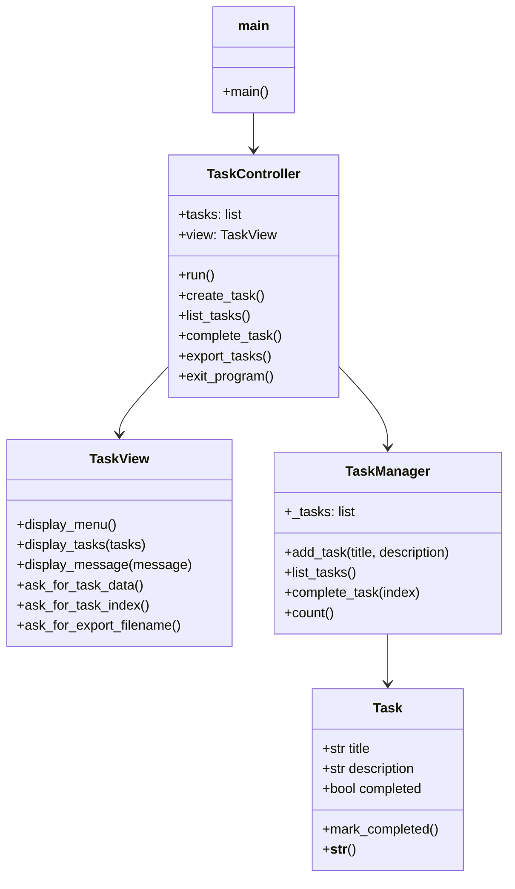

# Organizando Mi Mundo

Proyecto en Python para organizar tareas personales con Programación Orientada a Objetos (POO) y arquitectura MVC.

## Objetivo

Crear una aplicación de consola que permita:
- Crear tareas.
- Listar tareas.
- Marcar tareas como completadas.
- Exportar tareas a un archivo CSV.

## Integrantes del Proyecto

- José Rodríguez Escobar
- Brandon Altamar

## Requisitos del proyecto

- Lenguaje: Python
- Arquitectura: MVC (Modelo, Vista, Controlador)
- Programación: POO
- Librerías externas: `rich`, `pandas`
- Pruebas: `pytest`
- Documentación: `README.md`, `docs/proceso_desarrollo.md`
- Diagrama de clases: `docs/diagrama_clases.mmd`
- Código en GitHub

## Estructura del proyecto

```
organizando-mi-mundo/
  README.md
  CONTRIBUTING.md
  requirements.txt
  .gitignore
  src/
    organizando_mi_mundo/
      __init__.py
      main.py
      controllers/
        task_controller.py
      models/
        task.py
        task_manager.py
      views/
        task_view.py
  tests/
    conftest.py
    test_task.py
    test_task_manager.py
  docs/
    proceso_desarrollo.md
    diagrama_clases.mmd
    screenshots/
```

## Tecnologías y librerías

- `rich`: mejora la presentación en la consola con tablas, paneles y colores.
- `pandas`: permite exportar tareas a CSV fácilmente.
- `pytest`: framework de pruebas unitarias.

## Cómo instalar dependencias

1. Abre la terminal en VS Code.
2. Asegúrate de estar en la carpeta del proyecto.
3. Ejecuta:

```powershell
python -m pip install -r requirements.txt
```

## Cómo ejecutar el proyecto

```powershell
python src\organizando_mi_mundo\main.py
```

## Cómo ejecutar las pruebas

```powershell
python -m pytest
```

## Ejecutar y depurar en Visual Studio Code

1. Abre la carpeta `organizando-mi-mundo` en VS Code.
2. Asegúrate de seleccionar el intérprete Python del entorno virtual (`.venv`).
3. Para ejecutar el script directamente desde la terminal integrado, usa:

```powershell
python src\organizando_mi_mundo\main.py
```

4. Para depuración, crea o usa `.vscode/launch.json` con una configuración Python; ejemplo mínimo:

```json
{
  "version": "0.2.0",
  "configurations": [
    {
      "name": "Python: Ejecutar main",
      "type": "python",
      "request": "launch",
      "program": "${workspaceFolder}/src/organizando_mi_mundo/main.py",
      "console": "integratedTerminal"
    }
  ]
}
```

Nota: el repositorio incluye `.vscode/launch.json` orientado a Chrome; si quieres, puedo añadir la configuración Python por ti.

## Arquitectura MVC

- `models/`: define las estructuras de datos y reglas de negocio.
- `views/`: presenta la información al usuario y solicita entradas.
- `controllers/`: controla el flujo, procesa entradas y actualiza modelo y vista.

## Diagrama de clases

El diagrama de clases está disponible en `docs/diagrama_clases.mmd`.



## Cómo documentar capturas de pantalla

Guarda las capturas de pantalla en `docs/screenshots/`.
Puedes usar nombres como:
- `estructura_proyecto.png`
- `instalacion_dependencias.png`
- `ejecucion_programa.png`
- `pruebas_pytest.png`

## Cómo subir el proyecto a GitHub

1. Crea un repositorio en GitHub.
2. Inicializa Git en el proyecto:

```powershell
git init
```

3. Agrega archivos al área de preparación:

```powershell
git add .
```

4. Crea el primer commit:

```powershell
git commit -m "Inicializa proyecto Organizando Mi Mundo con MVC y POO"
```

5. Crea un repositorio remoto y conéctalo. Reemplaza `<URL_REMOTE>` con la URL de tu repositorio:

```powershell
git remote add origin <URL_REMOTE>
```

6. Sube el commit inicial:

```powershell
git branch -M main
git push -u origin main
```

7. Después de cada cambio importante, crea nuevos commits:

- `git add .`
- `git commit -m "Agrega exportación a CSV con pandas"`
- `git commit -m "Integra Rich en la interfaz de consola"`
- `git commit -m "Añade pruebas unitarias con pytest"`

8. Sube los nuevos commits:

```powershell
git push
```

## Notas finales

Este proyecto está diseñado para mostrar claramente:
- separación de responsabilidades con MVC,
- uso de clases en Python,
- integración de librerías externas,
- pruebas automatizadas,
- documentación y entrega profesional.
